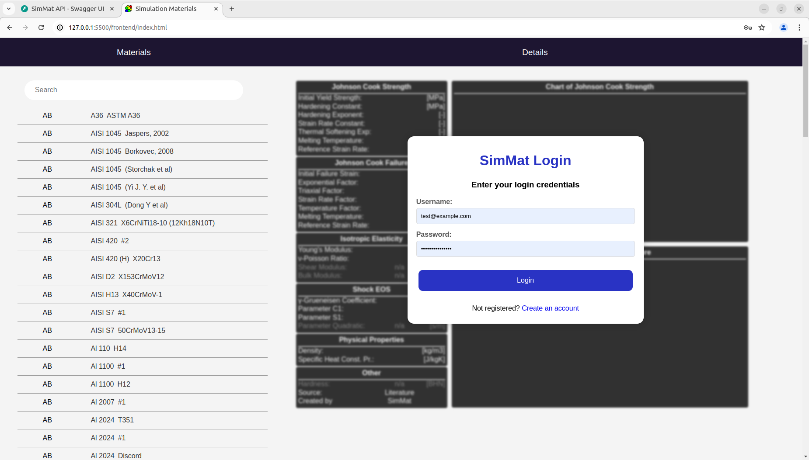
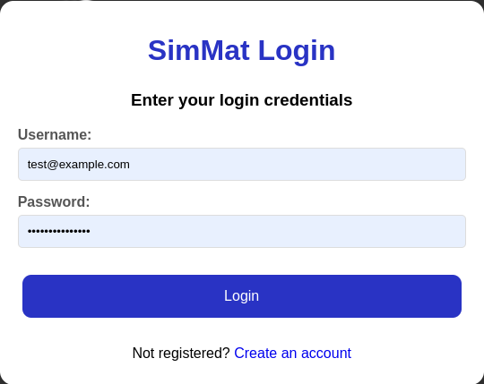
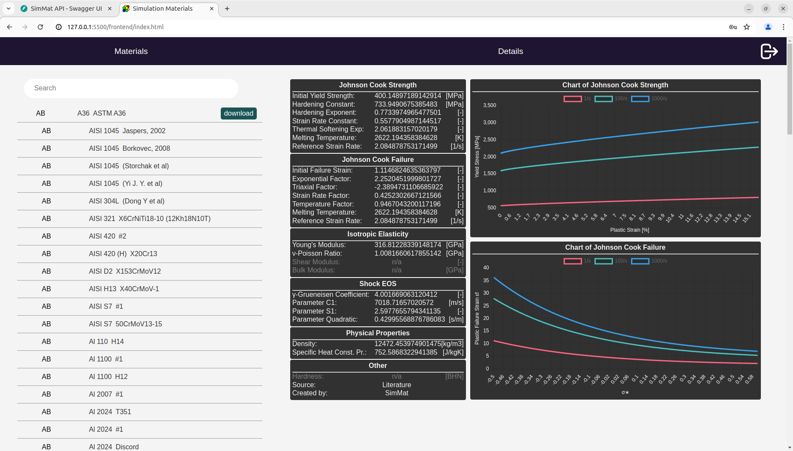

<h2>Frontend Development</h2>

<h3>Collecting UX steps</h3>

- Login
- Create Account
- Search Materials
- View Materials
- Download Materials
- Superuser Manage Materials
- Superuser Manage Users

<h3>UI Planning</h3>

- SPA

- Easy Login

- Show User Functionalities

<h3>Build</h3>

- Vanilla JS - SPA
- Liveserver
- Google Chrome Devtools 
- BDD

<h3>API Integration</h3>

- OpenAPI
- CORS local dev: google-chrome --disable-web-security --allow-file-access-from-files --user-data-dir="~/test"  